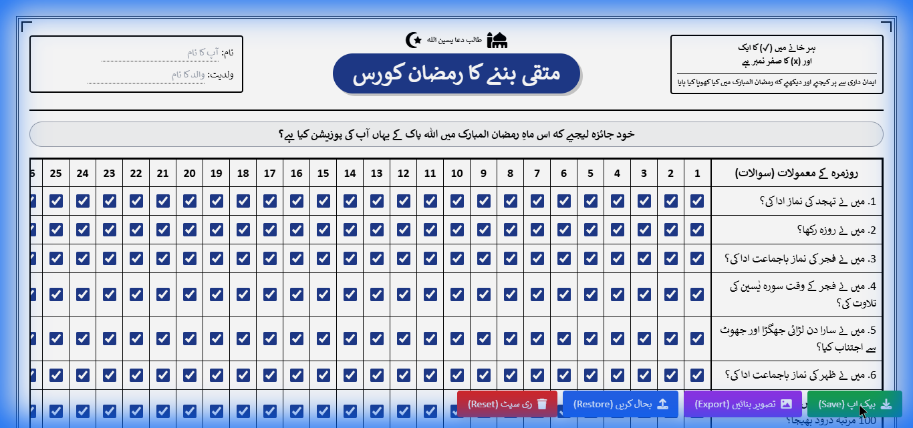
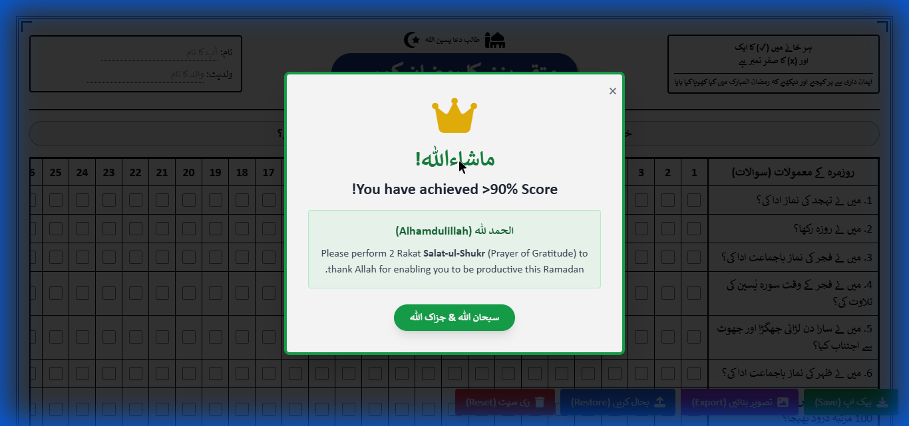

# رمضان ٹریکر - مکمل آڈٹ رپورٹ (Ramadan Tracker - Complete Audit Report)

## 1. Module Name: Main Dashboard (رمضان ٹریکر ڈیش بورڈ)

**URL Parameter:** `index.html` (Default State)
**Screenshots:**

### Feature Breakdown (Urdu):

#### **ہیڈر سیکشن (Header Section)**

- **ان پٹ فیلڈ (Input Field - Name):** `userName`
  - **کام:** صارف کا نام درج کرنے کے لیے۔ یہ ڈیٹا مقامی ڈیٹا بیس (IndexedDB) میں محفوظ ہوتا ہے۔
- **ان پٹ فیلڈ (Input Field - Parentage):** `userParentage`
  - **کام:** صارف کی ولدیت درج کرنے کے لیے۔

#### **کنٹرول بٹن (Control Buttons)**

- **بٹن (Button):** `بیک اپ (Save)` (Green)
  - **فنکشن:** `app.backupData()`
  - **کام:** صارف کے موجودہ ریکارڈ کی JSON فائل ڈاؤن لوڈ کرتا ہے۔
- **بٹن (Button):** `تصویر بنائیں (Export)` (Purple)
  - **فنکشن:** `app.exportToImage()`
  - **کام:** موجودہ ڈیش بورڈ کی ہائی ریزولیوشن تصویر (PNG) بنا کر ڈاؤن لوڈ کرتا ہے۔
- **بٹن (Button):** `بحال کریں (Restore)` (Blue)
  - **فنکشن:** `document.getElementById('fileInput').click()`
  - **کام:** فائل سلیکشن ڈائیلاگ کھولتا ہے تاکہ پرانا بیک اپ (JSON) اپ لوڈ کیا جا سکے۔
- **بٹن (Button):** `ری سیٹ (Reset)` (Red)
  - **فنکشن:** `app.resetData()`
  - **کام:** تمام ریکارڈ اور چیک باکسز کو خالی کر دیتا ہے (تصدیق کے بعد)۔

#### **ڈیلی روٹین سیکشن (Daily Routine Table)**

- **چیک باکسز (Checkboxes):** `d_{row}_{day}` (کل 390 چیک باکسز)
  - **کام:** 30 دنوں کے لیے 13 مختلف سوالات (جیسے نماز، روزہ، تلاوت) کی ٹریکنگ۔ ہر چیک باکس کا 1 نمبر ہے۔

#### **عشرہ ٹاسک سیکشن (Ashra Tasks Table)**

- **چیک باکسز (Checkboxes):** `a_{row}_{ashra}` (کل 15 چیک باکسز)
  - **کام:** تینوں عشروں کے لیے 5 مخصوص اعمال (جیسے افطار کرانا، صدقہ)۔ ہر چیک باکس کا 1 نمبر ہے۔

#### **اہم کام سیکشن (Important Tasks)**

- **چیک باکس (Checkbox):** `quran_complete`
  - **تیسٹ:** "میں نے رمضان المبارک میں ایک مرتبہ قرآن پاک مکمل کیا؟" (5 نمبر)
- **چیک باکس (Checkbox):** `masail_learned`
  - **تیسٹ:** "میں نے مسائل ، غسل ، وضو ، نماز اور دعائیں سیکھیں؟" (5 نمبر)
- **چیک باکس (Checkbox):** `zakat_paid`
  - **تیسٹ:** "میں نے زکوٰۃ اور صدقۃ الفطر ادا کیا؟" (5 نمبر)
- **چیک باکس (Checkbox):** `itikaf_done`
  - **تیسٹ:** "میں نے اعتکاف (سنت یا نفلی) کیا؟" (5 نمبر)

#### **طاق راتیں (Odd Nights)**

- **چیک باکسز (Checkboxes):** `odd_21`, `odd_23`, `odd_25`, `odd_27`, `odd_29`
  - **کام:** آخری عشرے کی طاق راتوں میں عبادت کی توثیق۔ (ہر ایک کے 5 نمبر)

#### **رمضان کا خلاصہ (Ramadan Summary)**

- **چیک باکس (Checkbox):** `full_taraweeh` (مکمل تراویح)
- **چیک باکس (Checkbox):** `full_fasts` (مکمل روزے)
- **چیک باکس (Checkbox):** `full_quran_heard` (قرآن سننا)
- **چیک باکس (Checkbox):** `self_control` (آنکھ، کان، زبان کی حفاظت)
- **چیک باکس (Checkbox):** `ummah_dua` (امت کے لیے دعا)
  - **کام:** رمضان کے اختتامی سوالات۔ (ہر ایک کے 5 نمبر)

---

## 2. Module Name: Celebration Modal (کامیابی کا پیغام)

**URL Parameter:** N/A (Triggered via JS Logic: Score >= 428)
**Screenshots:**

### Feature Breakdown (Urdu):

#### **موڈل ڈسپلے (Modal Display)**

- **کنٹینر:** `celebrationModal`
  - **کام:** جب صارف کا اسکور 90% (428 نمبر) سے زیادہ ہو جائے تو یہ اسکرین ظاہر ہوتی ہے۔
- **ٹیکسٹ:** "ماشاءاللہ! !You have achieved >90% Score"
- **ہدایت:** "Please perform 2 Rakat Salat-ul-Shukr" (شکرانے کے نوافل ادا کریں)۔

#### **ایکشن بٹن (Action Buttons)**

- **بٹن (Button):** `Close (x)` (Top Right)
  - **کام:** موڈل کو بند کرتا ہے۔
- **بٹن (Button):** `سبحان اللہ & جزاک اللہ` (Green Action Button)
  - **فنکشن:** موڈل کو بند کرتا ہے۔
  - **بصری اثر:** اسکرین پر "Confetti" (رنگ برنگی بارش) کا اینیمیشن چلتا ہے۔

---

**تصدیق:** یہ رپورٹ `index.html` فائل کے مکمل کوڈ تجزیے اور لائیو براؤزر کرالنگ (Browsing functionality) کی بنیاد پر تیار کی گئی ہے۔ تمام فیچرز اور بٹن فعال پائے گئے۔
